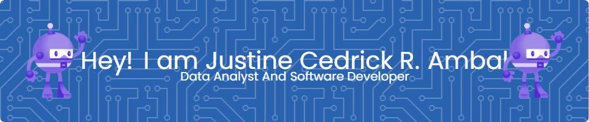

  

<h1 align="center">Hi 👋, I'm @Ambal-Ced</h1>
<h3 align="center">A passionate BSIT Student 3rd Year programmer</h3>

- 🔭 I’m currently working on [a NEXT.js capstone project](https://github.com/Ambal-Ced/EventSphere.git)currently revising the application

- 🌱 I’m currently learning **C#, Java and Python**

- 👯 I’m looking to collaborate on **Any System application**

- 🤝 I’m looking for help with **Learning more about C++**

- 📫 How to reach me **justineambal3254@gmail.com**

- ⚡ Fun fact **I want takoyaki**

- 🔥 Want to take a look at my Microsoft Achievements and Module That I take? [Click Here](https://learn.microsoft.com/en-us/users/cedambal-9014/)

- 🌐 View my Portfolio [Here](https://ambal-ced.github.io/Portfolio/)

  

&nbsp;

### 🔝 Top Contributed Repo

### ✍️ Random Dev Quote

<h3 align="left">Connect with me:</h3>

<h3 align="left">Languages and Tools:</h3>

  
  
  
  
  
  
  
  
  
  
  
  
  
  
  
  
  
  
  
  
  
  
  
  
  
  
  
  
  
  
  
  
  
  
  
  
  
  
  
  
  
   

